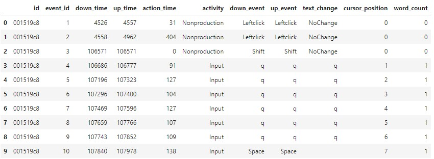
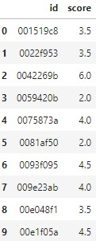
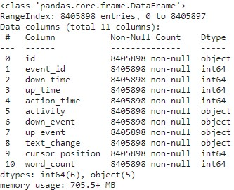
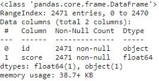
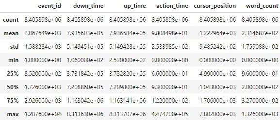
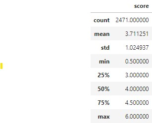

[predict_energy_behavior_of_prosumers](https://www.kaggle.com/c/predict-energy-behavior-of-prosumers)

## Overview
글쓰기 품질을 예측하기 위한 모델을 만드는 대회이다.  
데이터는 키스트로크 로그 데이터로 이루어져 있다.(시계열)  

## Description
글쓰기 과정을 정형데이터로 만들기가 쉽지 않다. 에세이별로 작성자의 특성(쉬는 타이밍, 수정법, ...)을 파악하여 품질에 영향을 줄 수 있다. 하지만 실제는 결과물만 가지고 평가를 하게 되어서 실질적인 활용에 있어서는 고려해야할 사항이 많다.  

## Evaluation
평가지표로는 MAE평가지표를 기반으로 사용한다. 

## simple EDA

**키스트로크 로그 데이터는 아래와 같이 구성이 된다.**
* id는 에세이를 구별하는 인자 
* event_id는 해당하는 에세이에서 발생하는 서순을 확인하기 위한 인자 
* down_time은 해당 키는 누르는 시점의 시간 
* up_time은 해당 키를 떼는 시점의 시간 
* action_time는 up_time - down_time 
* activity는 취한 액션이 어떠한 활동인지를 구별하는 인자 
* down_event, up_event는 어떤 키스트로크인지 구별하는 인자(단순한 문자는 q로 마스킹 처리됨) 
* text_change는 해당 event를 통하여 변경된 logs를 나타내는 인자 
* cursor_position은 깜빡이는 커서가 현재 어디 있는지 나타내는 인자 
* word_count는 작성된 단어의 갯수 

**점수 데이터는 아래와 같이 구성이 된다.**
* id는 에세이를 구별하는 인자 
* score는 에세이의 점수 

**키스트로크 로그의 info는 아래와 같이 결측값은 없다.**

**점수 데이터의 info는 아래와 같이 결측값은 없다.**

**키스트로크 로그의 describe는 아래와 같다.**

**점수 데이터의 describe는 아래와 같다.**

## Review 1

* XGBM
    * weather datas
    * installed_capacity

태양광 패널의 용량과 날씨 데이터가 결과에 영향을 미치는것을 알 수 있었다.

## Review 2

$ _ {23.11.24}$  

  